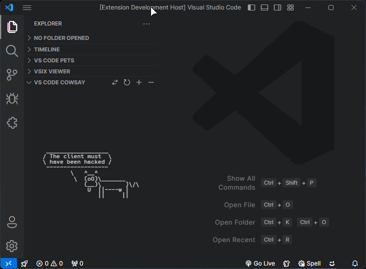

# VS Code Cowsay

If you have a lot of screen real estate, like wasting it, and especially if you're already rocking [VS Code Pets](https://marketplace.visualstudio.com/items?itemName=tonybaloney.vscode-pets), hold on to your udders. This extension is for you! ~~Proudly~~ presenting VS Code Cowsay, bringing the [classic ASCII art bovine](https://en.wikipedia.org/wiki/Cowsay) directly to your editor.

Why? I don't know... for funsies! 🐮

## Credits

This extension uses the [cowsay](https://github.com/piuccio/cowsay) library by piuccio for generating the ASCII art cows and messages.

## Features

- Cowsay sidebar with random programming excuse messages
- Zoom in and out functionality
- Refresh button for new cow-tent
- Multiple animals in selection
- Ability to set an interval for message refresh

## Installation

1. Open VS Code
2. Go to Extensions (Ctrl+Shift+X)
3. Search for "VS Code Cowsay"
4. Click Install

## Usage

1. Open the VS Code Cowsay sidebar from the Explorer view
2. Enjoy random cow messages!
3. Use the toolbar buttons to:
   - Change the animal
   - Refresh for a new message
   - Zoom in
   - Zoom out
4. Think about finally decluttering extension list that pilled up over time.

## Commands

This extension contributes the following commands:

- `vscode-cowsay.refresh`: Refresh Cowsay
- `vscode-cowsay.zoomIn`: Zoom In Cowsay
- `vscode-cowsay.zoomOut`: Zoom Out Cowsay
- `vscode-cowsay.changeAnimal`: Change "animal"

## Requirements

VS Code 1.92.0 or higher (No idea if it works on lower versions but if you're not updating VS Code, shame on you!)

## Extension Settings

The extension contributes the following settings:

- `vscode-cowsay.autoRefreshInterval`: Set the interval (in minutes) for automatically refreshing the Cowsay message. Default is 0 (disabled).

You can also add a keyboard shortcut for refresh by going to Manage > Keyboard shortcuts, searching for `vscode-cowsay.refresh`, and assigning a shortcut to it.

## Known Issues

No known issues at this time. If you encounter any problems, please file an issue on the GitHub repository.

## Release Notes

### 0.5.0

- Extension now keeps the animal you selected after restart.

### 0.4.0

- Added auto-refresh interval option in User Settings (press Ctrl+, then search for cowsay and look for "Auto Refresh Interval setting under Vscode-cowsay" section and enter the desired interval in minutes).

### 0.3.0

- Added more "animals" and ability to change them.
- Added developer excuses instead of cow puns.
- Improved design and code compatibility.

### 0.2.0

- Added zoom functionality.
- Improved sidebar UI.

### 0.1.0

- Initial release of VS Code Cowsay.
- Basic Cowsay sidebar with refresh functionality.

## Contributing

Contributions are welcome! Please feel free to submit a Pull Request.

## License

This extension is licensed under the [MIT License](LICENSE).
